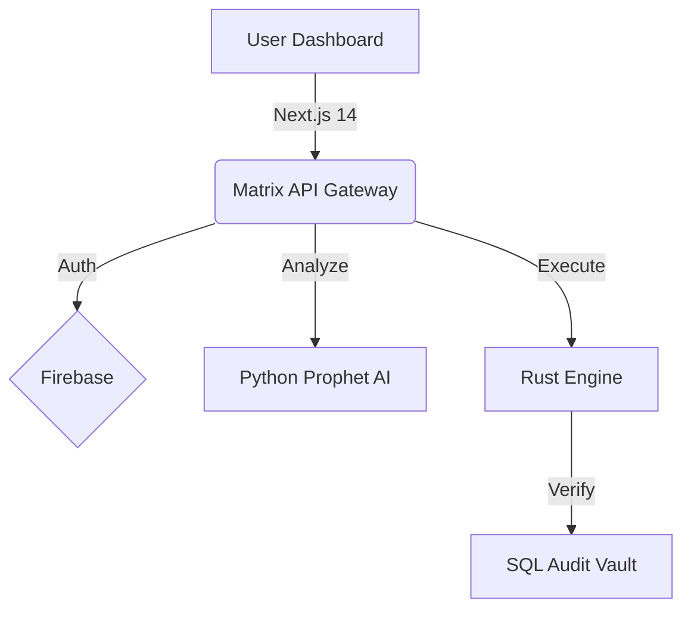

# 🚀 Dhanmatrixcapital

> **Institutional-grade wealth management for the modern investor.**  
> Built on a multi-core architecture mixing Next.js 14, Python AI, and Rust execution protocols.

[](https://dhanmatrixcapital.vercel.app)
[](LICENSE)
[]()

---

## 📑 Table of Contents

- [Overview](#-overview)
- [Key Features](#-key-features)
- [The Matrix Architecture](#-the-matrix-architecture)
- [Tech Stack](#-tech-stack)
- [Getting Started](#-getting-started)
- [Deployment](#-deployment)
- [Community & Support](#-community--support)

---

## 💎 Overview

**Dhanmatrixcapital** is not just a dashboard; it's a sophisticated financial protocol designed for high-resolution wealth tracking. We bridge the gap between complex institutional tools and accessible personal finance.

- **For Investors**: A layout optimized for 1600px+ ultra-wide screens, giving you the full picture without the clutter.
- **For Developers**: A masterclass in modern JAMstack architecture, featuring a hybrid Next.js frontend and a Python/Rust computational backend.

---

## ✨ Key Features

### 📊 **Ultra-Wide Institutional Dashboard**
Specifically engineered for high-DPI displays.
- **12-Column Grid**: Information density optimized for pro users.
- **Physics-Based UI**: Framer Motion elements that react to cursor proximity.
- **Sticky Widgets**: Keep AI predictions and news streams in view while analyzing data.

### 🤖 **Matrix Prophet AI**
Our proprietary forecasting engine (`matrix_core`).
- **Monte Carlo Simulations**: Runs 1,000+ paths to predict ROI with 95% confidence.
- **Vectorized Compute**: NumPy-optimized backend for sub-millisecond calculations.
- **Real-Time Insight**: Live projections based on current portfolio health.

### 🛡️ **Enterprise-Grade Security**
- **Authentication**: Multi-factor via Phone/OTP and Google OAuth (Firebase).
- **Compliance**: Structured for SEBI-compliant double-entry ledger auditing.
- **Privacy**: Local-first Firestore persistence for privacy and offline access.

---

## 🏗️ The Matrix Architecture

Dhanmatrixcapital uses a specialized multi-language backend to handle different aspects of wealth management:

| Core Component | Language | Role |
| :--- | :--- | :--- |
| **Matrix Prophet** | Python (FastAPI) | AI growth forecasting & risk simulation |
| **Execution Engine** | Rust | High-frequency calculation scaffold |
| **Yield Vault** | Solidity | Decentralized asset allocation contracts |
| **Audit Vault** | SQL | Immutable financial ledgers |



---

## ⚡ Tech Stack

**Frontend**
- **Framework**: Next.js 14 (App Router)
- **Language**: TypeScript 5.9 (Strict typing)
- **Styling**: Tailwind CSS 3.0 + Framer Motion 12
- **State**: React Context + Firestore Realtime

**Backend & Ops**
- **Database**: Google Firestore (NoSQL)
- **Compute**: Python 3.11 + NumPy
- **Monitoring**: Sentry + Vercel Speed Insights
- **Hosting**: Vercel Edge Network

---

## 🚀 Getting Started

### Prerequisites
- Node.js 18+
- Python 3.11 (for AI core)
- Firebase Project Credentials

### 1. Clone & Install
```bash
git clone https://github.com/codewithyuvraj24/TheDhanMatrix.git
cd TheDhanMatrix
npm install
```

### 2. Configure Environment
Create a `.env.local` file in the root:
```env
NEXT_PUBLIC_FIREBASE_API_KEY=your_key
NEXT_PUBLIC_FIREBASE_AUTH_DOMAIN=your_domain
NEXT_PUBLIC_FIREBASE_PROJECT_ID=your_id
NEXT_PUBLIC_GA_MEASUREMENT_ID=your_ga_id
```

### 3. Run Development Server
```bash
npm run dev
# Visit http://localhost:3001
```

### 4. Run AI Core (Optional)
```bash
cd matrix_core/analytics
pip install -r requirements.txt
uvicorn main:app --reload
```

---

## 🚢 Deployment

The project is optimized for **Vercel**.

1. Push your code to the `main` branch.
2. Import the project in Vercel.
3. Add the Environment Variables.
4. Deploy!

*PWA features and sitemap generation happen automatically during the build process.*

---

## 🤝 Community & Support

We believe in open finance. Join our community to contribute or get help.

- 📜 [**Code of Conduct**](CODE_OF_CONDUCT.md): Our pledge for a healthy community.
- 🛠️ [**Contributing Guide**](CONTRIBUTING.md): How to set up and submit PRs.
- 🐛 [**Security Policy**](SECURITY.md): Reporting vulnerabilities.
- 📄 [**License**](LICENSE): MIT License.

---

<p align="center">
  Built with ❤️ for the 🇮🇳 Indian Investor Community.
  <br>
  <strong>Dhanmatrixcapital Engineering</strong>
</p>
